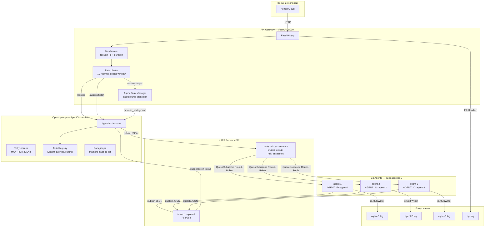
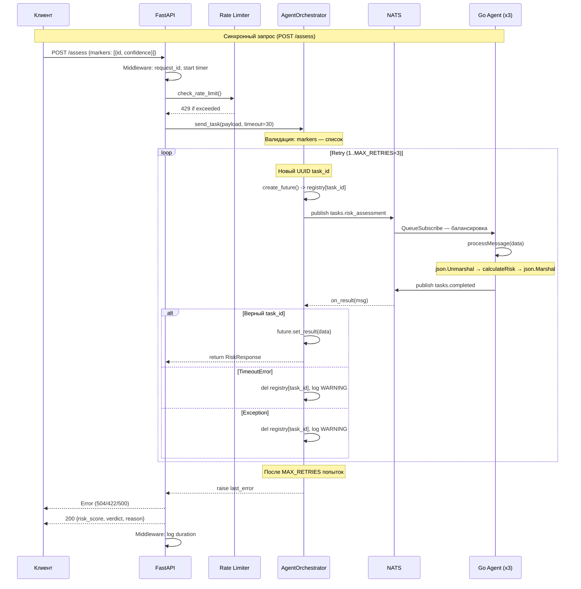

# Лабораторная работа №13 — Мультиагентная система борьбы с мошенничеством

**Студент:** Толстошеев Даниил Олегович  
**Группа:** 220032-11  
**Вариант:** 26 — Система борьбы с мошенничеством (Fraud Detection)  
**Сложность:** средняя  

---

## Выполненные задания

| № | Задание | Реализация |
|---|---|---|
| 1 | Определение агентов и их ролей | `docs/task1.md` — 4 агента (Сбор транзакций, Анализ паттернов, Оценка риска, Блокировка) |
| 2 | Разработка прототипа агента на Go | `agent/main.go` — агент «Оценка риска» |
| 3 | Разработка оркестратора на Python | `orchestrator/orchestrator.py` — класс `AgentOrchestrator` |
| 4 | Настройка коммуникации через NATS | `docker-compose.yml` — NATS + оркестратор + агенты |
| 5 | Логирование и мониторинг | Логи в файл + консоль, счётчики задач |
| 6 | Обработка ошибок и таймаутов | Retry 3x, timeout 30s, валидация |
| 7 | Запуск нескольких агентов одного типа | 3 экземпляра агента, Queue Group |
| 8 | Создание API для запуска задач | FastAPI, 5 эндпоинтов, rate limiter |
| 9 | Тестирование системы | 105 тестов (20 Go + 40 оркестратор + 45 API) |
| 10 | Документирование архитектуры | `docs/task10.md` — Mermaid-диаграммы, описание |

---

## Архитектура системы

```
         ┌──────────┐
         │  Клиент  │
         └────┬─────┘
              │ HTTP :8000
         ┌────▼──────┐
         │  FastAPI  │  api/main.py
         │  REST API │  Rate limiter (10 req/min)
         └────┬──────┘
              │ send_task()
         ┌────▼──────────┐
         │  Оркестратор  │  orchestrator/orchestrator.py
         │ AgentOrch-    │  Retry 3x, asyncio.Future
         │  estrator     │  Task registry
         └────┬──────────┘
              │ publish / subscribe
         ┌────▼──────┐
         │   NATS    │  docker-compose.yml
         │  :4222    │  nats:2.10-alpine
         └────┬──────┘
              │ Queue Group "risk_assessors"
    ┌─────────┼─────────┐
 ┌──▼───┐ ┌──▼───┐ ┌──▼───┐
 │agent-1│ │agent-2│ │agent-3│  Go-агенты
 │Risk   │ │Risk   │ │Risk   │  agent/main.go
 │Assess.│ │Assess.│ │Assess.│
 └───────┘ └───────┘ └───────┘
```

Полная архитектура с Mermaid-диаграммами — в `docs/task10.md`.

### Компонентная диаграмма (Mermaid)



### Sequence-диаграмма обработки транзакции



---

## Технологический стек

| Компонент | Технология | Версия |
|---|---|---|
| API Gateway | Python FastAPI + uvicorn | 0.115.6 / 0.34.0 |
| Оркестратор | Python asyncio + nats-py | 3.13 / 2.14.0 |
| Go-агент | Go + nats.go | 1.26.1 / 1.50.0 |
| Брокер сообщений | NATS Server | 2.10-alpine |
| Валидация | Pydantic | 2.10.4 |
| Контейнеризация | Docker + Docker Compose | — |

---

## Структура проекта

```
lab13/
├── .gitignore              19 правил: *.exe, *.pyc, __pycache__, logs/, *.log и др.
├── AGENTS.md               Инструкции для opencode (не коммитится)
├── PROMPT_LOG.md           Лог промптов для всех 10 заданий
├── README.md               Настоящий файл
├── docker-compose.yml      NATS + 3 агента + оркестратор + API
│
├── agent/                  Go-агент «Оценка риска»
│   ├── main.go             157 строк: структуры, calculateRisk, processMessage, NATS
│   ├── main_test.go        285 строк: 20 table-driven тестов
│   ├── go.mod              module lab13/agent, go 1.26.1
│   ├── go.sum
│   ├── Dockerfile          multi-stage: golang:1.26-alpine → alpine:latest
│   └── .dockerignore       agent.log, *.md
│
├── orchestrator/           Python-оркестратор
│   ├── orchestrator.py     108 строк: AgentOrchestrator, retry, Future
│   ├── main.py             84 строк: точка входа, 6 сценариев
│   ├── __init__.py         Экспорт AgentOrchestrator, констант, MAX_RETRIES
│   ├── requirements.txt    nats-py==2.14.0, pytest==8.4.2, pytest-asyncio==1.3.0
│   ├── Dockerfile          python:3.13-slim
│   ├── .dockerignore       __pycache__, *.pyc, .pytest_cache
│   └── tests/
│       ├── conftest.py     30 строк: фикстуры, resolve_futures
│       ├── test_orchestrator.py  297 строк: 37 unit-тестов
│       └── test_multi_agent.py   89 строк: 3 e2e-теста
│
├── api/                    FastAPI REST API
│   ├── main.py             186 строк: 5 эндпоинтов, rate limiter, lifespan
│   ├── __init__.py         Пустой (маркер пакета)
│   ├── requirements.txt    fastapi==0.115.6, uvicorn==0.34.0, nats-py==2.14.0, pydantic==2.10.4
│   ├── Dockerfile          python:3.13-slim, uvicorn
│   ├── .dockerignore       __pycache__, *.pyc, .pytest_cache
│   └── tests/
│       ├── conftest.py     45 строк: mock-фикстуры, noop_lifespan
│       ├── test_api.py     326 строк: 39 unit-тестов
│       └── test_e2e.py     107 строк: 6 e2e-тестов
│
└── docs/
    ├── task1.md            Роли и спецификации агентов
    └── task10.md           Архитектура системы (Mermaid, компоненты)
```

---

## Детали реализации

### Go-агент (`agent/main.go`)

Агент «Оценка риска» реализует бизнес-логику расчёта скора мошенничества.

**Структуры данных:**
```go
type Marker struct {
    ID         string  `json:"id"`
    Confidence float64 `json:"confidence"`
}
type RiskRequest struct {
    TransactionID string   `json:"transaction_id"`
    Markers       []Marker `json:"markers"`
}
type RiskResponse struct {
    TransactionID string `json:"transaction_id"`
    RiskScore     int    `json:"risk_score"`
    Verdict       string `json:"verdict"`
    Reason        string `json:"reason"`
}
```

**Веса маркеров:**
- `BLACKLIST_HIT` — 80 баллов
- `IMPOSSIBLE_TRAVEL` — 50 баллов
- `VELOCITY_ATTACK` — 30 баллов
- Неизвестные маркеры игнорируются (не влияют на скор)

**Формула расчёта:**
`finalScore = clamp(round(sum(weight_marker * confidence_marker)), 0, 100)`

**Вердикты:**
| Диапазон | Вердикт |
|---|---|
| 0–30 | LOW |
| 31–80 | MEDIUM |
| 81–100 | HIGH |

**NATS:**
- Подписка: `QueueSubscribe("tasks.risk_assessment", "risk_assessors", handler)`
- Публикация: `Publish("tasks.completed", response)`
- Ошибки декодирования JSON: sentinel `errDecode` → DEBUG лог (не ERROR)

**Логирование:**
- `io.MultiWriter(os.Stdout, logFile)` — дублирование в консоль и `agent.log`
- Префикс `[agentID]` + временная метка (`log.LstdFlags`)
- Файл: `os.OpenFile("agent.log", O_CREATE|O_WRONLY|O_APPEND, 0644)`
- При ошибке открытия файла — fallback на stdout-only с WARNING-логом

**Завершение:**
- Канал сигналов: `os.Interrupt` (Windows) + `syscall.SIGTERM` (Docker/Linux)
- После сигнала: вывод статистики processedTasks → `nc.Drain()` → завершение

---

### Оркестратор (`orchestrator/orchestrator.py`)

Класс `AgentOrchestrator` — центральный координатор.

**Методы:**

| Метод | Аргументы | Что делает |
|---|---|---|
| `connect(url)` | `url="nats://localhost:4222"` | Подключается к NATS |
| `start_listener()` | — | Подписывается на `tasks.completed` |
| `send_task(payload, timeout)` | `Dict[str, Any]`, `int=30` | Отправляет задачу, ждёт результат |
| `on_result(msg)` | `Msg` | Обрабатывает ответ от агента |
| `disconnect()` | — | Отключается от NATS |

**Retry-логика:**
1. Валидация `markers` — не список → `ValueError` (без retry)
2. Цикл 1..MAX_RETRIES (3):
   - Новый UUID на каждую попытку
   - `publish` в `tasks.risk_assessment`
   - `wait_for(future, timeout=timeout)`
   - `TimeoutError` → retry, `Exception` → retry
   - `finally`: очистка registry
3. После исчерпания попыток — `raise last_error`

**Типы:**
```python
class RiskRequest(TypedDict):
    transaction_id: str
    markers: List[Dict[str, Any]]

class RiskResponse(TypedDict):
    transaction_id: str
    risk_score: int
    verdict: str
    reason: str
```

---

### API Gateway (`api/main.py`)

FastAPI-приложение с lifespan-управлением подключением к NATS.

**Эндпоинты:**

| Метод | Путь | Описание | Код ответа |
|---|---|---|---|
| `GET` | `/health` | Healthcheck | 200 |
| `POST` | `/assess` | Синхронная оценка риска | 200 / 422 / 504 / 429 / 500 |
| `POST` | `/assess/async` | Асинхронная (task_id) | 200 / 422 / 429 |
| `GET` | `/status/{task_id}` | Статус асинхронной задачи | 200 / 404 |
| `POST` | `/assess/batch` | Массовая оценка (последовательно) | 200 / 422 / 504 / 429 / 500 |

**Pydantic-модели:**
```python
class MarkerModel(BaseModel):
    id: str
    confidence: float = Field(..., ge=0.0, le=1.0)
```

**Rate limiter:**
- Sliding window: 60 секунд
- Лимит: 10 запросов (настраивается через `RATE_LIMIT`)
- Thread-safe: `threading.Lock`

**Middleware:**
- request_id (первые 8 символов UUID)
- Логирование метода, пути, статуса и длительности запроса

---

### Docker Compose

```yaml
services:
  nats:                    # nats:2.10-alpine, порты 4222+8222, restart: always
  agent-1/2/3:             # 3 экземпляра Go-агента (YAML anchor)
                           # AGENT_ID, volume logs, restart: always
  orchestrator:            # Одноразовый запуск (restart: "no")
  api:                     # FastAPI на порту 8000 (restart: "no")
```

Логи монтируются как Docker volumes: `./logs/agent-{1,2,3}.log:/app/agent.log`, `./logs/api.log:/app/api.log`.

---

## NATS-коммуникация

**Subjects:**

| Subject | Тип | Назначение |
|---|---|---|
| `tasks.risk_assessment` | Queue Group `risk_assessors` | Очередь задач для агентов. NATS распределяет сообщения между подписчиками Round-Robin |
| `tasks.completed` | Pub/Sub | Результаты. Оркестратор и API подписываются на этот канал |

**Формат сообщения (запрос):**
```json
{
  "transaction_id": "uuid-v4",
  "markers": [{"id": "BLACKLIST_HIT", "confidence": 1.0}]
}
```

**Формат сообщения (ответ):**
```json
{
  "transaction_id": "uuid-v4",
  "risk_score": 80,
  "verdict": "MEDIUM",
  "reason": "Score 80 based on: [BLACKLIST_HIT(80.00)]"
}
```

---

## Логирование

### Go-агент
- Механизм: `io.MultiWriter(os.Stdout, logFile)` — дублирование в консоль и `agent.log`
- Формат: `[agentID] YYYY/MM/DD HH:MM:SS LEVEL: message`
- Файл: `agent.log` (append mode, `os.O_CREATE|O_WRONLY|O_APPEND`)
- Уровни: `INFO` — запуск/завершение/обработка, `ERROR` — ошибки публикации, `WARNING` — ошибка открытия файла, `DEBUG` — decode-ошибки, `FATAL` — фатальные ошибки (NATS, подписка)
- При ошибке открытия файла — fallback на stdout-only с WARNING-логом

### Python-оркестратор
- Механизм: `logging.basicConfig` с `FileHandler(mode="w")` + `StreamHandler`
- Формат: `YYYY-MM-DD HH:MM:SS,ms LEVEL message`
- Файл: `orchestrator.log` (перезапись при каждом запуске)
- Module-level логгер: `logger = logging.getLogger(__name__)`
- Эффект "первый вызвал — тот и настроил": при импорте из `api/main.py` (который первым вызывает `basicConfig`) оркестратор использует конфигурацию API

### Python API
- Механизм: `logging.basicConfig` + `FileHandler(mode="w")` + `StreamHandler`
- Формат: `YYYY-MM-DD HH:MM:SS,ms LEVEL name message` (включает имя логгера)
- Файл: `api.log` (перезапись при каждом запуске)
- Middleware: логирует каждый HTTP-запрос с `request_id`, методом, путём, статусом и длительностью

---

## Безопасность и thread safety

| Компонент | Проблема | Решение |
|---|---|---|
| Go agent | Race condition на `processedTasks` | `sync.Mutex` — Lock/Unlock при чтении и записи |
| Python API | Race condition на `rate_history` | `threading.Lock` — контекстный менеджер `with rate_lock:` |
| Python API | `background_tasks` — словарь | Однопоточный asyncio (все операции в одном event loop) |
| Python orchestrator | `results` — словарь Future | Однопоточный asyncio, `get_running_loop()` |
| Go agent | Signal channel | Буферизированный канал `make(chan os.Signal, 1)` — неблокирующая отправка |
| Cross-platform | Сигналы в Windows | `try/except NotImplementedError` в Python |
| NATS | Потеря соединения | `nc.Drain()` в Go, `nc.close()` в Python |

---

## Сборка и запуск

### Требования

- Docker Engine 24+
- Docker Compose v2+

### Быстрый старт

```bash
# 1. Клонировать репозиторий
git clone <url>
cd lab13

# 2. Собрать образы
docker compose build

# 3. Запустить стек
docker compose up -d

# 4. Проверить
curl http://localhost:8000/health

# 5. Отправить транзакцию
curl -X POST http://localhost:8000/assess \
  -H "Content-Type: application/json" \
  -d '{"markers":[{"id":"BLACKLIST_HIT","confidence":1.0}]}'

# 6. Просмотр логов
docker compose logs agent-1
docker compose logs api

# 7. Остановить
docker compose down
```

### Примеры API-запросов

**Синхронная оценка:**
```bash
curl -X POST http://localhost:8000/assess \
  -H "Content-Type: application/json" \
  -d '{"markers":[{"id":"BLACKLIST_HIT","confidence":1.0}]}'
# → {"risk_score":80,"verdict":"MEDIUM","reason":"Score 80 based on: [BLACKLIST_HIT(80.00)]"}
```

**Низкий риск:**
```bash
curl -X POST http://localhost:8000/assess \
  -H "Content-Type: application/json" \
  -d '{"markers":[]}'
# → {"risk_score":0,"verdict":"LOW","reason":"Score 0 based on: []"}
```

**Асинхронная оценка:**
```bash
TASK_ID=$(curl -s -X POST http://localhost:8000/assess/async \
  -H "Content-Type: application/json" \
  -d '{"markers":[{"id":"VELOCITY_ATTACK","confidence":0.5}]}' | \
  python -c "import sys,json;print(json.load(sys.stdin)['task_id'])")
curl http://localhost:8000/status/$TASK_ID
```

**Массовая оценка:**
```bash
curl -X POST http://localhost:8000/assess/batch \
  -H "Content-Type: application/json" \
  -d '{"tasks":[{"markers":[{"id":"BLACKLIST_HIT","confidence":1.0}]},{"markers":[{"id":"IMPOSSIBLE_TRAVEL","confidence":0.5}]}]}'
# → {"results":[{"risk_score":80,"verdict":"MEDIUM",...},{"risk_score":25,"verdict":"LOW",...}]}
```

**Ошибка валидации:**
```bash
curl -X POST http://localhost:8000/assess \
  -H "Content-Type: application/json" \
  -d '{}'
# → 422 {"detail":[{"type":"missing","loc":["body","markers"],...}]}
```

**Превышение rate limit (после 10 запросов за минуту):**
```bash
# 429 {"detail":"Rate limit exceeded"}
```

---

## Тестирование

### Локально (Windows/Linux)

**Go-агент (20 тестов):**
```bash
cd agent
go test -v ./...
```

**Оркестратор (40 тестов):**
```bash
python -m pytest orchestrator/tests/ -v
```

**API unit-тесты (39 тестов):**
```bash
python -m pytest api/tests/test_api.py -v
```

**Все Python-тесты:**
```bash
python -m pytest orchestrator/tests/ api/tests/ -v
```

### В Docker

**Go-тесты:**
```bash
docker run --rm -v ${PWD}:/app -w /app/agent golang:1.26-alpine \
  /bin/sh -c "apk add --no-cache git && go test -v ./..."
```

**Оркестратор:**
```bash
docker run --rm --network lab13_default -v ${PWD}:/app -w /app \
  python:3.13-slim /bin/sh -c \
  "pip install -q -r orchestrator/requirements.txt && \
   python -m pytest orchestrator/tests/ -v"
```

**API unit:**
```bash
docker run --rm --network lab13_default -v ${PWD}:/app -w /app \
  python:3.13-slim /bin/sh -c \
  "pip install -q -r api/requirements.txt && \
   python -m pytest api/tests/test_api.py -v"
```

**E2E (требует работающего стека):**
```bash
docker compose up -d
docker run --rm --network lab13_default -v ${PWD}:/app -w /app \
  python:3.13-slim /bin/sh -c \
  "pip install -q -r api/requirements.txt && \
   python -m pytest api/tests/test_e2e.py -v"
```

**Полный прогон в Docker (build → up → test → down):**
```bash
docker compose build && \
docker compose up -d && \
docker run --rm --network lab13_default -v ${PWD}:/app -w /app/agent golang:1.26-alpine \
  /bin/sh -c "apk add --no-cache git && go test -v ./..." && \
docker run --rm --network lab13_default -v ${PWD}:/app -w /app python:3.13-slim /bin/sh -c \
  "pip install -q -r orchestrator/requirements.txt -r api/requirements.txt && \
   python -m pytest orchestrator/tests/ api/tests/test_api.py api/tests/test_e2e.py -v" && \
docker compose down
```

### Сводка тестов

| Группа | Кол-во | Тип |
|---|---|---|
| Go agent — calculateRisk | 13 | unit, table-driven |
| Go agent — processMessage | 6 | unit, table-driven |
| Go agent — JSON pipeline | 1 | integration |
| Оркестратор — unit | 37 | unit, mocked NATS |
| Оркестратор — multi-agent e2e | 3 | e2e, Docker |
| API — unit | 39 | unit, mocked orchestrator |
| API — e2e | 6 | e2e, Docker stack |
| **Всего** | **105** | |

---

## Обработка ошибок

| Сценарий | Компонент | HTTP статус | Механизм |
|---|---|---|---|
| Невалидный JSON тела запроса | Pydantic / FastAPI | 422 | Validation Error |
| confidence < 0 или > 1 | Pydantic `Field(ge=0.0, le=1.0)` | 422 | Validation Error |
| markers — не список | `send_task()` → `ValueError` | 422 | ValueError (без retry) |
| Timeout агента (30s) | `asyncio.wait_for()` → `TimeoutError` | 504 | Retry (3x) → 504 |
| NATS не отвечает | `nats.connect()` → исключение | 500 | `ConnectionError` |
| Ошибка NATS publish | `nc.Publish()` → исключение | 500 | `RuntimeError` через retry |
| Rate limit превышен | `check_rate_limit()` | 429 | Sliding window + threading.Lock |
| Неизвестный task_id | `background_tasks.get()` → None | 404 | 404 Not Found |
| Decode ошибка в агенте | `errDecode` sentinel | — | DEBUG лог (не ERROR) |
| Ошибка публикации ответа | `nc.Publish()` в агенте | — | ERROR лог |
| Неверный HTTP метод | FastAPI | 405 | Method Not Allowed |
| Неверный путь | FastAPI | 404 | Not Found |
| Неподдерживаемые сигналы (Windows) | `try/except NotImplementedError` | — | WARNING лог, сигналы игнорируются |

---

## Документация

- `docs/task1.md` — Определение агентов и их ролей (4 агента, JSON-схемы, бизнес-правила)
- `docs/task10.md` — Архитектура системы (Mermaid-диаграммы, sequence diagram, полное описание компонентов)

---

## Переменные окружения

| Переменная | По умолчанию | Где используется | Описание |
|---|---|---|---|
| `NATS_URL` | `nats://localhost:4222` | agent, orchestrator, api | Адрес NATS-сервера |
| `AGENT_ID` | `agent` | agent | Идентификатор экземпляра агента |
| `RATE_LIMIT` | `10` | api | Максимум запросов в минуту |
