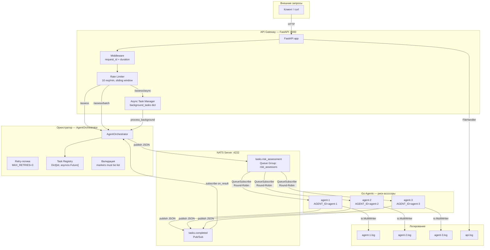
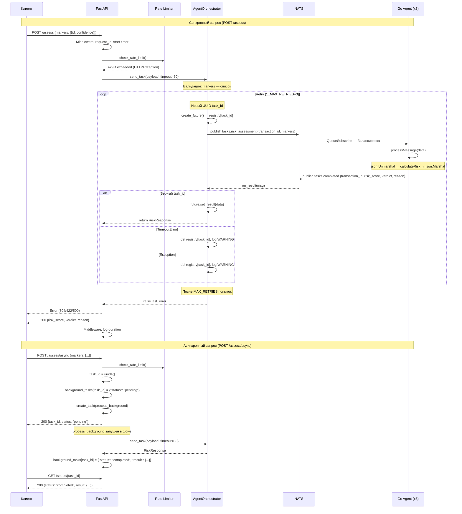

# Задание 10: Архитектура мультиагентной системы борьбы с мошенничеством

## 1. Общая архитектура

Система построена по микросервисной модели с асинхронной коммуникацией через брокер сообщений NATS. Всего в системе 4 компонента: API Gateway (FastAPI), оркестратор (Python asyncio), 3 экземпляра Go-агента «Оценка риска» и сервер NATS. Коммуникация между оркестратором и агентами происходит по модели Pub/Sub через два NATS-канала.



## 2. Полный поток обработки транзакции



## 3. Технологический стек

| Компонент | Технология | Версия | Назначение |
|---|---|---|---|
| API Gateway | Python FastAPI + uvicorn | 0.115.6 / 0.34.0 | REST HTTP API, 5 эндпоинтов |
| Оркестратор | Python asyncio + nats-py | 3.13 / 2.14.0 | Асинхронная координация агентов |
| Go-агент | Go + nats.go | 1.26.1 / 1.50.0 | Бизнес-логика расчёта риск-скора |
| Брокер сообщений | NATS Server | 2.10-alpine | Асинхронная коммуникация Pub/Sub |
| Контейнеризация | Docker + Docker Compose | latest | Развёртывание и оркестрация |
| Валидация данных | Pydantic | 2.10.4 | Валидация входящих JSON (API) |
| Тесты (Go) | testing (table-driven) | stdlib | Unit-тесты calculateRisk, processMessage |
| Тесты (Python) | pytest + pytest-asyncio + httpx | 8.4.2 / 1.3.0 | Unit + e2e тесты |
| Пакетирование | pip (requirements.txt) | — | Фиксация версий зависимостей |

## 4. Детальное описание компонентов

### 4.1 Go-агент «Оценка риска» (`agent/main.go`)

**Структуры данных**:
```go
type Marker struct {
    ID         string  `json:"id"`
    Confidence float64 `json:"confidence"`
}

type RiskRequest struct {
    TransactionID string   `json:"transaction_id"`
    Markers       []Marker `json:"markers"`
}

type RiskResponse struct {
    TransactionID string `json:"transaction_id"`
    RiskScore     int    `json:"risk_score"`
    Verdict       string `json:"verdict"`
    Reason        string `json:"reason"`
}
```

**Бизнес-логика (`calculateRisk`)**:
- Веса маркеров: `BLACKLIST_HIT` = 80, `IMPOSSIBLE_TRAVEL` = 50, `VELOCITY_ATTACK` = 30
- Формула: `finalScore = clamp(round(sum(weight * confidence)), 0, 100)`
- Неизвестные маркеры игнорируются (не добавляют score)
- Пороги вердиктов:
  - `0 ≤ score ≤ 30` → `LOW`
  - `31 ≤ score ≤ 80` → `MEDIUM`
  - `81 ≤ score ≤ 100` → `HIGH`
- Reason формируется как `"Score {N} based on: [MARKER1(x.xx) MARKER2(y.yy) ...]"`

**Конвейер (`processMessage`)**:
```go
data → json.Unmarshal → RiskRequest → calculateRisk → json.Marshal → response
```
- Вынесена в отдельную функцию для unit-тестирования
- Ошибки декодирования JSON оборачиваются в sentinel `errDecode`

**NATS-коммуникация**:
- QueueGroup: `risk_assessors`, Subject: `tasks.risk_assessment`
- Ответ публикуется в subject: `tasks.completed`
- Ошибки декодирования логируются как DEBUG (через `errors.Is(err, errDecode)`)
- Ошибки публикации логируются как ERROR

**Логирование**:
- `io.MultiWriter(os.Stdout, logFile)` — дублирование в консоль и `agent.log`
- Префикс `[agentID]` для идентификации экземпляра
- Формат времени: `log.LstdFlags`
- Файл: `os.OpenFile("agent.log", O_CREATE|O_WRONLY|O_APPEND, 0644)`
- Уровни: `INFO`, `ERROR`, `WARNING`, `DEBUG`, `FATAL`
- При ошибке открытия файла — fallback на stdout-only с WARNING-логом

**Обработка сигналов**:
```go
sigChan := make(chan os.Signal, 1)
signal.Notify(sigChan, os.Interrupt, syscall.SIGTERM)
<-sigChan
```
- Docker: `Stop signal` → `SIGTERM` (15)
- Windows: `Ctrl+C` → `os.Interrupt`
- После сигнала: вывод статистики processedTasks → `nc.Drain()` → завершение

**Thread safety**:
- `sync.Mutex` для защиты `processedTasks` (глобальный счётчик)

**Потенциальные проблемы**:
- `transaction_id` от клиента не валидируется (это ответственность агента «Сбор транзакций»)
- При ошибке `nc.Publish("tasks.completed", resp)` — результат теряется, retry не предусмотрен (агент не хранит состояние)

### 4.2 Оркестратор (`orchestrator/orchestrator.py`)

**Константы и типы**:
```python
SUBJECT_RISK_ASSESSMENT = "tasks.risk_assessment"
SUBJECT_COMPLETED = "tasks.completed"
MAX_RETRIES = 3

class RiskRequest(TypedDict):
    transaction_id: str
    markers: List[Dict[str, Any]]

class RiskResponse(TypedDict):
    transaction_id: str
    risk_score: int
    verdict: str
    reason: str
```

**Класс `AgentOrchestrator`**:

| Метод | Аргументы | Описание | Исключения |
|---|---|---|---|
| `__init__` | — | Инициализация: `nc=None`, `results={}`, `processed=0` | — |
| `connect` | `url="nats://localhost:4222"` | Подключение к NATS | — |
| `start_listener` | — | Подписка на `tasks.completed` | — |
| `on_result` | `msg: Msg` | Обработчик ответа: JSON decode → поиск task_id → set_result | логирует DEBUG при decode-ошибках |
| `send_task` | `payload, timeout=30` | Отправка задачи с retry | `ConnectionError`, `ValueError`, `TimeoutError`, `RuntimeError` |
| `disconnect` | — | Отключение от NATS | — |

**Детали `send_task`**:
1. Проверка `self.nc.is_connected` — иначе `ConnectionError`
2. Валидация `markers` — если не list → `ValueError` (без retry)
3. Цикл 1..MAX_RETRIES:
   - Генерация нового `uuid.uuid4()` (каждая попытка — новый ID)
   - Регистрация `results[task_id] = asyncio.get_running_loop().create_future()`
   - `publish(SUBJECT_RISK_ASSESSMENT, json.dumps(task_data).encode())`
   - `wait_for(future, timeout=timeout)`
   - Успех: `processed += 1`, возврат `cast(RiskResponse, result)`
   - `TimeoutError`: `last_error = TimeoutError(...)`, лог WARNING
   - `Exception`: `last_error = RuntimeError(...)`, лог WARNING
   - `finally`: `del results[task_id]` (очистка registry)
4. После цикла: `assert last_error is not None; raise last_error`

**Детали `on_result`**:
1. `json.loads(msg.data.decode())` — парсинг JSON
2. `isinstance(data, dict)` — проверка типа (отсекает `[]`)
3. `data.get("transaction_id")` — поиск ID
4. Если ID найден в `self.results`:
   - `if not future.done(): future.set_result(data)` — защита от повторной установки
   - `del self.results[task_id]` — очистка
5. Если ID найден, но нет в registry: лог `DEBUG "Unknown task result"`
6. `json.JSONDecodeError`, `UnicodeDecodeError`: лог `DEBUG "Failed to decode"`

**Конфигурация логирования** (module-level):
```python
logging.basicConfig(
    level=logging.INFO,
    format="%(asctime)s %(levelname)s %(message)s",
    handlers=[
        logging.FileHandler("orchestrator.log", mode="w", encoding="utf-8"),
        logging.StreamHandler()
    ]
)
logger = logging.getLogger(__name__)
```

**Эффект "первый вызвал — тот и настроил"**: т.к. `basicConfig` — no-op при уже настроенном root-логгере, при импорте из `api/main.py` (который первым вызывает `basicConfig`) оркестратор использует конфигурацию API.

### 4.3 Точка входа оркестратора (`orchestrator/main.py`)

- `NATS_URL = os.getenv("NATS_URL", "nats://localhost:4222")`
- Сигналы: `SIGINT`, `SIGTERM` → `add_signal_handler` → `shutdown_event.set()`
- `NotImplementedError` — fallback для Windows (сигналы не поддерживаются)
- 6 тестовых сценариев:
  | № | Название | payload | timeout | repeat | Ожидаемое поведение |
  |---|---|---|---|---|---|
  | 1 | HIGH Risk (Blacklist) | BLACKLIST_HIT@1.0 | 30 | 1 | Score=80, MEDIUM |
  | 2 | MEDIUM Risk | IMPOSSIBLE_TRAVEL@0.8 + VELOCITY_ATTACK@0.5 | 30 | 1 | Score=55, MEDIUM |
  | 3 | LOW Risk (Empty) | [] | 30 | 1 | Score=0, LOW |
  | 4 | Invalid Payload | markers="not a list" | 30 | 1 | ValueError (422) |
  | 5 | Retry Exhaustion | TEST@0.5 | 0.001 | 1 | 3x TimeoutError → 3 WARNING |
  | 6 | Batch (6 tasks) | TEST@0.5 | 30 | 6 | 6 ответов, распределение по 3 агентам |
- Логирование: `logger = logging.getLogger("main")`

### 4.4 API Gateway (`api/main.py`)

**Pydantic-модели**:
```python
class MarkerModel(BaseModel):
    id: str
    confidence: float = Field(..., ge=0.0, le=1.0)  # строгая валидация [0, 1]

class AssessRequest(BaseModel):
    markers: List[MarkerModel]

class AssessResponse(BaseModel):
    risk_score: int
    verdict: str
    reason: str

class TaskStatus(BaseModel):
    task_id: str
    status: str
    result: Optional[AssessResponse] = None
    error: Optional[str] = None

class BatchRequest(BaseModel):
    tasks: List[AssessRequest]

class BatchResponse(BaseModel):
    results: List[AssessResponse]

class HealthResponse(BaseModel):
    status: str = "ok"
```

**Глобальное состояние** (module-level):
```python
orchestrator: Optional[AgentOrchestrator] = None
background_tasks: Dict[str, Dict[str, Any]] = {}
rate_history: List[float] = []
rate_lock = threading.Lock()
```

**Эндпоинты**:

| Метод | Путь | Статусы ответа | Описание | timeout |
|---|---|---|---|---|
| GET | `/health` | 200 | Healthcheck | — |
| POST | `/assess` | 200, 422, 504, 429, 500 | Синхронная оценка | 30s |
| POST | `/assess/async` | 200, 422, 429 | Асинхронная (возвращает task_id) | 30s (фон) |
| GET | `/status/{task_id}` | 200, 404 | Статус асинхронной задачи | — |
| POST | `/assess/batch` | 200, 422, 504, 429, 500 | Массовая оценка (последовательно) | 60s на задачу |

**Детали эндпоинтов**:

`POST /assess`:
```python
check_rate_limit()  # 429 если превышен
payload = {"markers": [m.model_dump() for m in request.markers]}
try:
    result = await orchestrator.send_task(payload, timeout=30)
    return AssessResponse(...)
except asyncio.TimeoutError:
    raise HTTPException(504, "Task timed out")
except ValueError as e:
    raise HTTPException(422, str(e))
except Exception as e:
    logger.error(...)
    raise HTTPException(500, "Internal server error")
```

`POST /assess/async`:
- Создаёт `task_id = str(uuid.uuid4())`
- Сохраняет `background_tasks[task_id] = {"status": "pending"}`
- Запускает `asyncio.create_task(process_background(task_id, payload))`
- `process_background` вызывает `orchestrator.send_task(payload, timeout=30)` и обновляет статус

`GET /status/{task_id}`:
```python
entry = background_tasks.get(task_id)
if entry is None:
    raise HTTPException(404, "Task not found")
return TaskStatus(task_id=task_id, **entry)
```

`POST /assess/batch`:
- `check_rate_limit()` один раз на весь batch
- Последовательная отправка через `orchestrator.send_task(payload, timeout=60)`
- При ошибке на i-й задаче: `raise HTTPException` (batch прерывается)

**Rate Limiter**:
```python
RATE_LIMIT = int(os.getenv("RATE_LIMIT", "10"))
RATE_WINDOW = 60.0

def check_rate_limit() -> None:
    global rate_history, rate_lock
    with rate_lock:
        rate_history = [t for t in rate_history if now - t < RATE_WINDOW]
        if len(rate_history) >= RATE_LIMIT:
            raise HTTPException(429, "Rate limit exceeded")
        rate_history.append(now)
```
- Sliding window: фильтрация записей старше 60 секунд
- Thread-safe: `threading.Lock`

**Middleware**:
```python
@app.middleware("http")
async def log_requests(request, call_next):
    request_id = str(uuid.uuid4())[:8]
    start = time.time()
    response = await call_next(request)
    duration = time.time() - start
    logger.info("[%s] %s %s - %d (%.3fs)", ...)
    return response
```

**Lifespan**:
```python
@asynccontextmanager
async def lifespan(app):
    global orchestrator
    orchestrator = AgentOrchestrator()
    await orchestrator.connect(NATS_URL)
    await orchestrator.start_listener()
    yield
    await orchestrator.disconnect()
```

**Логирование**:
```python
logging.basicConfig(
    level=logging.INFO,
    format="%(asctime)s %(levelname)s %(name)s %(message)s",
    handlers=[
        logging.FileHandler("api.log", mode="w", encoding="utf-8"),
        logging.StreamHandler()
    ]
)
logger = logging.getLogger("api")
```
- Формат включает имя логгера (`%(name)s`)
- Файл: `api.log` (перезаписывается при каждом запуске — `mode="w"`)

### 4.5 NATS-коммуникация

**Subjects**:

| Subject | Тип | Назначение |
|---|---|---|
| `tasks.risk_assessment` | Queue Group `risk_assessors` | Очередь задач для агентов. NATS распределяет сообщения между подписчиками Round-Robin |
| `tasks.completed` | Pub/Sub | Результаты. Оркестратор и API подписываются на этот канал |

**Формат сообщения (запрос)**:
```json
{
  "transaction_id": "uuid-v4",
  "markers": [{"id": "BLACKLIST_HIT", "confidence": 1.0}]
}
```

**Формат сообщения (ответ)**:
```json
{
  "transaction_id": "uuid-v4",
  "risk_score": 80,
  "verdict": "MEDIUM",
  "reason": "Score 80 based on: [BLACKLIST_HIT(80.00)]"
}
```

### 4.6 Docker Compose (`docker-compose.yml`)

**YAML Anchor**:
```yaml
x-agent: &agent-base
  build: ./agent
  environment:
    NATS_URL: nats://nats:4222
  depends_on:
    - nats
  restart: always
```

**Сервисы**:

| Сервис | Образ/билд | Порты | Переменные | Volumes | Restart |
|---|---|---|---|---|---|
| nats | `nats:2.10-alpine` | 4222, 8222 | — | — | `always` |
| agent-1 | `./agent` (YAML anchor) | — | NATS_URL, AGENT_ID=agent-1 | `./logs/agent-1.log:/app/agent.log` | `always` |
| agent-2 | `./agent` (YAML anchor) | — | NATS_URL, AGENT_ID=agent-2 | `./logs/agent-2.log:/app/agent.log` | `always` |
| agent-3 | `./agent` (YAML anchor) | — | NATS_URL, AGENT_ID=agent-3 | `./logs/agent-3.log:/app/agent.log` | `always` |
| orchestrator | `./orchestrator` | — | NATS_URL | — | `"no"` |
| api | `.` (dockerfile: `api/Dockerfile`) | 8000 | NATS_URL | `./logs/api.log:/app/api.log` | `"no"` |

**Порядок запуска**: NATS → агенты (depends_on nats) → оркестратор / API

### 4.7 Dockerfile

**agent/Dockerfile** (multi-stage):
```dockerfile
FROM golang:1.26-alpine AS builder
WORKDIR /app
COPY go.mod go.sum ./
RUN go mod download
COPY . .
RUN CGO_ENABLED=0 GOOS=linux go build -o risk_assessor .

FROM alpine:latest
RUN apk --no-cache add ca-certificates
WORKDIR /app
COPY --from=builder /app/risk_assessor .
ENTRYPOINT ["./risk_assessor"]
```
- Stage 1: builder — скачивание зависимостей, компиляция
- Stage 2: runtime — alpine:latest (минимальный образ ~10 МБ)
- `CGO_ENABLED=0` — статическая линковка

**orchestrator/Dockerfile**:
```dockerfile
FROM python:3.13-slim
WORKDIR /app
COPY requirements.txt .
RUN pip install --no-cache-dir -r requirements.txt
COPY . .
CMD ["python", "main.py"]
```

**api/Dockerfile**:
```dockerfile
FROM python:3.13-slim
WORKDIR /app
COPY api/requirements.txt .
RUN pip install --no-cache-dir -r requirements.txt
COPY api/ ./api/
COPY orchestrator/ ./orchestrator/
ENV PYTHONPATH=/app
CMD ["uvicorn", "api.main:app", "--host", "0.0.0.0", "--port", "8000"]
```
- Копирует оба Python-модуля (api + orchestrator импортируется)
- `PYTHONPATH=/app` — для корректного импорта

### 4.8 .dockerignore

| Файл | Содержимое |
|---|---|
| `agent/.dockerignore` | `.gitignore`, `agent.log`, `*.md` |
| `orchestrator/.dockerignore` | `orchestrator.log`, `__pycache__/`, `*.pyc`, `.pytest_cache/`, `.gitignore` |
| `api/.dockerignore` | `__pycache__/`, `*.pyc`, `.pytest_cache/`, `.gitignore` |

### 4.9 .gitignore

19 правил: `*.exe`, `*.dll`, `*.so`, `*.pyc`, `__pycache__/`, `.venv/`, `venv/`, `.pytest_cache/`, `.coverage`, `htmlcov/`, `coverage/`, `*.db`, `*.db-journal`, `*.db-wal`, `*.db-shm`, `.env`, `AGENTS.md`, `logs/`, `*.log`

## 5. Обработка ошибок

| Сценарий | Компонент | Механизм | Статус HTTP |
|---|---|---|---|
| Невалидный JSON тела запроса | Pydantic / FastAPI | 422 Validation Error | 422 |
| confidence < 0 или > 1 | Pydantic `Field(ge=0.0, le=1.0)` | 422 Validation Error | 422 |
| markers — не список | `send_task()` → `ValueError` | 422 (без retry) | 422 |
| Timeout агента (30s) | `asyncio.wait_for()` → `TimeoutError` | Retry (3x) → 504 | 504 |
| NATS не отвечает | `nats.connect()` → исключение | `ConnectionError` | 500 |
| Ошибка NATS publish | `nc.Publish()` → исключение | `RuntimeError` через retry | 500 |
| Rate limit превышен | `check_rate_limit()` | 429 Too Many Requests | 429 |
| Неизвестный task_id | `background_tasks.get()` → None | 404 Not Found | 404 |
| Decode ошибка в агенте | `errDecode` sentinel | DEBUG лог (не ERROR) | — |
| Ошибка публикации ответа | `nc.Publish()` в агенте | ERROR лог | — |
| Неверный HTTP метод | FastAPI | 405 Method Not Allowed | 405 |
| Неверный путь | FastAPI | 404 Not Found | 404 |
| Неподдерживаемые сигналы (Windows) | `try/except NotImplementedError` | WARNING лог, сигналы игнорируются | — |

## 6. Логирование

### Go-агент
- Механизм: `io.MultiWriter(os.Stdout, logFile)`
- Формат: `[agentID] YYYY/MM/DD HH:MM:SS LEVEL: message`
- Файл: `agent.log` (append mode)
- Уровни: `INFO` — запуск/завершение/обработка, `ERROR` — ошибки публикации, `WARNING` — ошибка открытия файла, `DEBUG` — decode-ошибки, `FATAL` — фатальные ошибки (NATS, подписка)

### Python-оркестратор
- Механизм: `logging.basicConfig` с `FileHandler(mode="w")` + `StreamHandler`
- Формат: `YYYY-MM-DD HH:MM:SS,ms LEVEL message`
- Файл: `orchestrator.log` (перезапись при каждом запуске)
- Module-level логгер: `logger = logging.getLogger(__name__)`

### Python API
- Механизм: `logging.basicConfig` + `FileHandler(mode="w")` + `StreamHandler`
- Формат: `YYYY-MM-DD HH:MM:SS,ms LEVEL name message` (включает имя логгера)
- Файл: `api.log` (перезапись при каждом запуске)
- Middleware: логирует каждый HTTP-запрос с `request_id`, методом, путём, статусом и длительностью

## 7. Тестирование

### 7.1 Go-тесты (`agent/main_test.go`)

**20 тестов, 3 функции:**

`TestCalculateRisk` (13 table-driven subtests):
| Subtest | Маркеры | Confidence | Score | Вердикт |
|---|---|---|---|---|
| Low risk — no markers | [] | — | 0 | LOW |
| Low risk — low confidence | VELOCITY_ATTACK | 0.1 | 3 | LOW |
| Low risk — boundary | VELOCITY_ATTACK | 1.0 | 30 | LOW |
| Medium risk — boundary start | VELOCITY_ATTACK (1.0) + VELOCITY_ATTACK (0.1) | — | 33 | MEDIUM |
| Medium risk — combined | VELOCITY_ATTACK (1.0) + IMPOSSIBLE_TRAVEL (0.5) | — | 55 | MEDIUM |
| Medium risk — boundary end | BLACKLIST_HIT | 1.0 | 80 | MEDIUM |
| High risk — boundary start | BLACKLIST_HIT (1.0) + VELOCITY_ATTACK (0.1) | — | 83 | HIGH |
| High risk — multiple critical | BLACKLIST_HIT (1.0) + IMPOSSIBLE_TRAVEL (0.8) | — | 100 | HIGH |
| Edge — unknown marker | UNKNOWN_MARKER | 1.0 | 0 | LOW |
| Edge — zero confidence | BLACKLIST_HIT | 0.0 | 0 | LOW |
| Edge — negative confidence | VELOCITY_ATTACK | -1.0 | 0 | LOW |
| Edge — overflow clamped | BLACKLIST_HIT | 2.0 | 100 | HIGH |
| Edge — empty transaction_id | [] | — | 0 | LOW |

`TestProcessMessage` (6 subtests):
| Subtest | Input | Ожидаемый score | Ошибка? |
|---|---|---|---|
| valid message with markers | BLACKLIST_HIT@1.0 | 80 | нет |
| valid message without markers | [] | 0 | нет |
| valid message with multiple markers | BLACKLIST_HIT@1.0 + VELOCITY_ATTACK@0.5 | 95 | нет |
| invalid json | `{bad json` | — | да |
| empty input | `` | — | да |
| missing transaction_id | BLACKLIST_HIT@1.0 | 80 | нет (не обязателен для агента) |

`TestJSONPipeline` (1 интеграционный): input → unmarshal → calculateRisk → marshal → unmarshal → assert score=95 verdict=HIGH

### 7.2 Python-тесты оркестратора (`orchestrator/tests/`)

**Фикстуры (`conftest.py`)**:
- `orchestrator`: `AgentOrchestrator` с `AsyncMock()` вместо `nats.NATS`
- `resolve_futures(registry, result, count)`: асинхронный хелпер, polling 200× с sleep 0.01, авто-разрешение Future в registry

**`test_orchestrator.py` (37 тестов, 18 функций)**:

| Тест | Что проверяет |
|---|---|
| `test_connect` | patch nats.connect, assert_called_once_with |
| `test_send_task_success` | 4 сценария (markers → score + verdict), publish.assert_called_once, очистка registry |
| `test_send_task_timeout` | 2 таймаута (0.01, 0.001) → TimeoutError, очистка registry |
| `test_send_task_not_connected` | is_connected=False → ConnectionError |
| `test_send_task_invalid_payloads` | 3 варианта (string, wrong_key, {}) → ValueError, очистка registry |
| `test_send_task_additional_invalid` | 2 варианта (no_markers_field, None) → ValueError |
| `test_on_result_valid` | 3 варианта (LOW/HIGH/MEDIUM) → future.done(), score, verdict, очистка |
| `test_on_result_malformed` | 4 варианта (invalid json, wrong_id, [], '') → future not done |
| `test_on_result_already_done` | future уже разрешён → не перезаписывается |
| `test_on_result_unknown_task` | неизвестный task_id → registry не меняется |
| `test_disconnect` | nc.close.assert_called_once |
| `test_disconnect_when_not_connected` | nc=None → no error |
| `test_processed_counter_increments` | processed 0→1 после send_task |
| `test_disconnect_with_processed` | processed=5, лог содержит число |
| `test_start_listener_subscribes_correctly` | subscribe с SUBJECT_COMPLETED |
| `test_connect_logs_url` | лог содержит URL |
| `test_send_task_logs` | лог содержит "Sending task" и "completed" |
| `test_disconnect_logs_processed` | лог содержит "Total tasks processed: 3" |
| `test_retry_success_on_second_attempt` | 1-я попытка Exception, 2-я успех, publish.call_count == 2 |
| `test_retry_exhaustion` | 3 TimeoutError → raise, publish.call_count == MAX_RETRIES |
| `test_retry_no_retry_on_validation_error` | 3 варианта → ValueError, publish.call_count == 0 |
| `test_retry_logs_warning_on_each_retry` | 3 WARNING-лога "timed out" |
| `test_concurrent_tasks` | 3 параллельные задачи через gather, processed==3, registry пуст |

**`test_multi_agent.py` (3 e2e-теста)**:
| Тест | Что проверяет |
|---|---|
| `test_load_balancing[3]` | 3 задачи → хотя бы 1 агент получил работу |
| `test_load_balancing[6]` | 6 задач → все 3 агента получили работу |
| `test_no_messages_lost` | 5 задач → все 5 успешны, score=0 |

### 7.3 Python-тесты API (`api/tests/`)

**Фикстуры (`conftest.py`)**:
- `noop_lifespan`: заглушка для `app.router.lifespan_context` (отключает реальный NATS)
- `mock_orch`: `AsyncMock()` с `send_task.return_value = {"risk_score": 50, "verdict": "MEDIUM", ...}`
- `client`: `TestClient` с подменённым lifespan и orchestrator
- `reset_state` (autouse): очистка `background_tasks` + `rate_history` под `rate_lock`

**`test_api.py` (39 тестов, 8 классов)**:

`TestHealth` (3):
- `test_ok`: GET /health → 200, `{"status":"ok"}`
- `test_wrong_method`: POST /health → 405
- `test_wrong_path`: GET /healthx → 404

`TestAssess` (13):
- `test_success`: 4 PARAMETRIZE (BLACKLIST_HIT=80/MEDIUM, HIGH_FREQUENCY=30/LOW, GEO_ANOMALY=50/MEDIUM, empty=0/LOW)
- `test_timeout`: TimeoutError → 504
- `test_value_error`: ValueError → 422
- `test_internal_error`: Exception → 500
- `test_invalid_body`: 8 PARAMETRIZE (empty, markers_not_list, id_not_string, confidence_not_number, missing_confidence, missing_id, negative_confidence, overflow_confidence)
- `test_wrong_method`: GET /assess → 405

`TestAssessAsync` (4):
- `test_creates_task`: POST → 200, status=pending, task_id не пуст
- `test_invalid_body`: {} → 422
- `test_background_stores_entry`: task_id сохранён в background_tasks
- `test_wrong_method`: GET → 405

`TestStatus` (5):
- `test_completed`: вручную внесён completed → 200, result с данными
- `test_pending`: pending → 200, result=None, error=None
- `test_failed`: failed → 200, error="Something went wrong"
- `test_not_found`: несуществующий ID → 404
- `test_wrong_method`: POST → 405

`TestBatch` (6):
- `test_success`: 2 задачи → 200, results=[..., ...]
- `test_empty_tasks`: [] → 200, results=[]
- `test_timeout`: TimeoutError → 504
- `test_value_error`: ValueError → 422
- `test_invalid_body`: {} → 422
- `test_wrong_method`: GET → 405

`TestProcessBackground` (4):
- `test_completed`: mock_orch успех → status=completed, score=50
- `test_timeout`: TimeoutError → status=failed, "timed out"
- `test_exception`: ValueError → status=failed, "bad data"
- `test_pending_overwritten`: pending → completed c новыми данными

`TestRateLimit` (1):
- `test_exceeded`: 10×200, 1×429

**`test_e2e.py` (6 тестов, против полного Docker стека)**:
| Тест | Описание |
|---|---|
| `test_health` | GET /health → 200 |
| `test_assess_sync` | POST /assess BLACKLIST_HIT → score=80, verdict=MEDIUM |
| `test_assess_batch` | POST /assess/batch 2 задачи → 2 результата по 80 |
| `test_assess_async_flow` | POST /assess/async → pending → pooling → completed |
| `test_assess_validation_error` | POST /assess {} → 422 |
| `test_status_not_found` | GET /status/non-existent → 404 |

### 7.4 Сводка тестов

| Группа | Тестов | Тип | Запуск |
|---|---|---|---|
| Go agent — calculateRisk | 13 | unit, table-driven | `go test -v` |
| Go agent — processMessage | 6 | unit, table-driven | `go test -v` |
| Go agent — JSON pipeline | 1 | integration | `go test -v` |
| **Go итого** | **20** | | |
| Orchestrator — unit | 37 | unit, mocked NATS | `pytest orchestrator/tests/test_orchestrator.py` |
| Orchestrator — multi-agent e2e | 3 | e2e, Docker | `pytest orchestrator/tests/test_multi_agent.py` |
| **Orchestrator итого** | **40** | | |
| API — unit | 39 | unit, mocked orchestrator | `pytest api/tests/test_api.py` |
| API — e2e | 6 | e2e, Docker stack | `pytest api/tests/test_e2e.py` |
| **API итого** | **45** | | |
| **Всего** | **105** | | |

## 8. Деплоймент

```bash
# Сборка образов
docker compose build

# Запуск стека
docker compose up -d

# Проверка
curl http://localhost:8000/health
# → {"status":"ok"}

# Отправка транзакции
curl -X POST http://localhost:8000/assess \
  -H "Content-Type: application/json" \
  -d '{"markers":[{"id":"BLACKLIST_HIT","confidence":1.0}]}'
# → {"risk_score":80,"verdict":"MEDIUM","reason":"Score 80 based on: [BLACKLIST_HIT(80.00)]"}

# Асинхронная отправка
curl -X POST http://localhost:8000/assess/async \
  -H "Content-Type: application/json" \
  -d '{"markers":[{"id":"VELOCITY_ATTACK","confidence":0.5}]}'
# → {"task_id":"uuid","status":"pending","result":null,"error":null}

# Проверка статуса
curl http://localhost:8000/status/{task_id}
# → {"task_id":"uuid","status":"completed","result":{...},"error":null}

# Массовая оценка
curl -X POST http://localhost:8000/assess/batch \
  -H "Content-Type: application/json" \
  -d '{"tasks":[{"markers":[{"id":"BLACKLIST_HIT","confidence":1.0}]},{"markers":[{"id":"IMPOSSIBLE_TRAVEL","confidence":0.5}]}]}'
# → {"results":[{"risk_score":80,...},{"risk_score":25,...}]}

# Логи
docker compose logs agent-1
docker compose logs api

# Остановка
docker compose down
```

## 9. Полная структура проекта

```
lab13/
├── .gitignore                    # 19 правил: exe, dll, so, pyc, __pycache__, .venv, logs, *.log, AGENTS.md
├── AGENTS.md                     # Инструкции для opencode (не коммитится)
├── PROMPT_LOG.md                 # Лог промптов для 10 заданий
├── README.md                     # ФИО, группа, вариант
├── docker-compose.yml            # NATS + 3 агента + оркестратор + API
│
├── agent/                        # Go-агент «Оценка риска»
│   ├── .dockerignore             # agent.log, *.md
│   ├── Dockerfile                # multi-stage: golang:1.26-alpine → alpine
│   ├── go.mod                    # module lab13/agent, go 1.26.1, nats.go v1.50.0
│   ├── go.sum
│   ├── main.go                   # 157 строк: Marker, RiskRequest/Response, weights, calculateRisk,
│   │                             # processMessage, main() с NATS, QueueSubscribe, сигналы, логи
│   └── main_test.go              # 285 строк: TestCalculateRisk (13), TestProcessMessage (6), TestJSONPipeline (1)
│
├── orchestrator/                 # Python-оркестратор
│   ├── .dockerignore             # orchestrator.log, __pycache__, *.pyc, .pytest_cache
│   ├── Dockerfile                # python:3.13-slim
│   ├── requirements.txt          # nats-py==2.14.0, pytest==8.4.2, pytest-asyncio==1.3.0
│   ├── __init__.py               # Экспорт AgentOrchestrator, констант, MAX_RETRIES
│   ├── orchestrator.py           # 108 строк: AgentOrchestrator, connect/start_listener/on_result/
│   │                             # send_task (retry 3)/disconnect, TypedDict, basicConfig
│   ├── main.py                   # 84 строк: точка входа, 6 сценариев, graceful shutdown
│   ├── orchestrator.log          # runtime-артефакт
│   └── tests/
│       ├── __init__.py
│       ├── conftest.py           # 30 строк: orchestrator (AsyncMock), resolve_futures
│       ├── test_orchestrator.py  # 297 строк: 37 тестов (18 функций)
│       └── test_multi_agent.py   # 89 строк: 3 e2e-теста (load_balancing 3/6, no_messages_lost)
│
├── api/                          # FastAPI REST API
│   ├── .dockerignore             # __pycache__, *.pyc, .pytest_cache
│   ├── Dockerfile                # python:3.13-slim, uvicorn
│   ├── requirements.txt          # fastapi==0.115.6, uvicorn==0.34.0, nats-py==2.14.0, pydantic==2.10.4
│   ├── __init__.py               # пустой (маркер пакета)
│   ├── main.py                   # 186 строк: Pydantic модели, lifespan, middleware, 5 эндпоинтов,
│   │                             # rate limiter (threading.Lock), process_background
│   └── tests/
│       ├── __init__.py
│       ├── conftest.py           # 45 строк: noop_lifespan, mock_orch, client, reset_state
│       ├── test_api.py           # 326 строк: 39 тестов (8 классов)
│       └── test_e2e.py          # 107 строк: 6 e2e-тестов (Docker stack)
│
└── docs/
    ├── task1.md                  # Определение агентов и их ролей (198 строк)
    └── task10.md                 # Архитектура системы (текущий файл)
```

## 10. Безопасность и thread safety

| Компонент | Проблема | Решение |
|---|---|---|
| Go agent | Race condition на `processedTasks` | `sync.Mutex` — Lock/Unlock при чтении и записи |
| Python API | Race condition на `rate_history` | `threading.Lock` — контекстный менеджер `with rate_lock:` |
| Python API | `background_tasks` — словарь | Однопоточный asyncio (все операции в одном event loop) |
| Python orchestator | `results` — словарь Future | Однопоточный asyncio, `get_running_loop()` |
| Go agent | Signal channel | Буферизированный канал `make(chan os.Signal, 1)` — неблокирующая отправка |
| Cross-platform | Сигналы в Windows | `try/except NotImplementedError` в Python |
| NATS | Потеря соединения | `nc.Drain()` в Go, `nc.close()` в Python |
